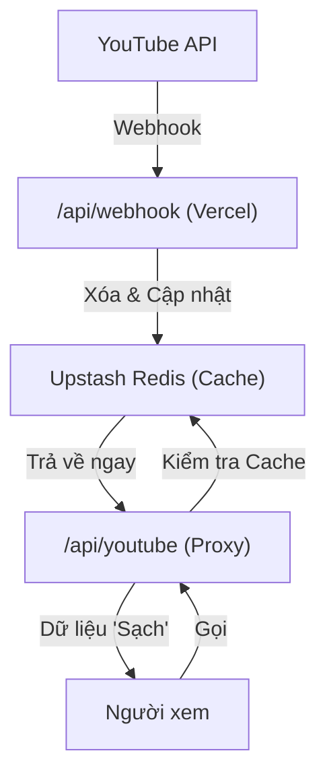

# PLAN: Triển khai Backend Proxy v2.0 (Vercel + Redis + Webhook)

## 💡 Giải đáp thắc mắc
1. **Custom Domain:** Bạn hoàn toàn có thể cấu hình Domain riêng (mua từ Namecheap, GoDaddy...) trỏ về Vercel cực kỳ đơn giản và miễn phí phần cấu hình.
2. **Lưu trữ (Redis):** Jarvis sẽ sử dụng **Upstash Redis**. 
    - **Tại sao?** Trên Vercel (theo dạng Serverless), chúng ta không thể lưu file JSON vì mỗi lần chạy nó lại ở một máy chủ khác nhau. Redis là "bộ nhớ chung" tuyệt vời nhất.
    - **Chi phí:** Upstash có gói **Free** (10,000 requests/ngày) - dư dùng cho dự án của bạn mà không tốn một xu.
3. **Webhook & Livestream:** Jarvis sẽ xây dựng 1 cổng nhận tín hiệu từ YouTube (PubSubHubbub). Khi bạn bật Stream, YouTube sẽ "gõ cửa" Proxy này, và Proxy sẽ tự động ưu tiên đẩy Livestream đó lên vị trí số 1 của Hero Carousel.

---

## 🏗️ Kiến trúc chi tiết

---

## 📝 Các bước thực hiện

### Phase 1: Hạ tầng (Infrastructure)
- [ ] Khởi tạo dự án trên Vercel.
- [ ] Thiết lập tài khoản Upstash Redis (Jarvis sẽ hướng dẫn lấy Token).
- [ ] Cấu hình Environment Variables (`UPSTASH_REDIS_URL`, `UPSTASH_REDIS_TOKEN`).

### Phase 2: Code Backend (API Functions)
- [ ] Tạo Endpoint `/api/youtube`: Trả về dữ liệu đã tổng hợp (Hero, Latest, Playlists).
- [ ] Viết logic "Smart Fetch": Chỉ gọi YouTube API khi Redis hết hạn (hàng giờ).
- [ ] Tạo Endpoint `/api/webhook`: Nhận thông tin Livestream mới từ YouTube.

### Phase 3: Đồng bộ Frontend
- [ ] Sửa lại `youtubeService.js`: Chuyển từ gọi `google.com` sang gọi `/api/youtube`.
- [ ] Xóa bỏ API Key khỏi code Frontend để bảo mật tuyệt đối.

---
## 🚩 Các rủi ro/Lưu ý
- Cần verify domain của bạn với YouTube để setup Webhook (Jarvis sẽ hướng dẫn).
- Cần cài đặt thêm thư viện `@upstash/redis`.
